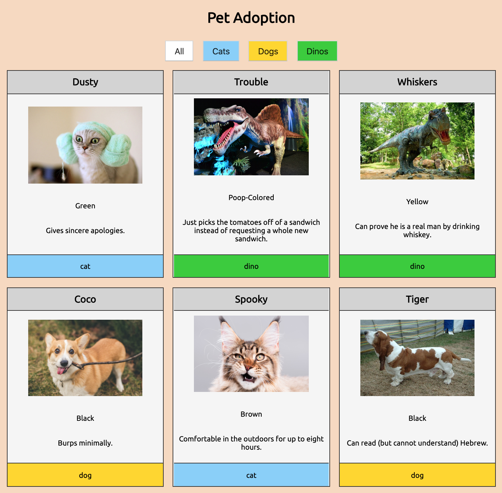
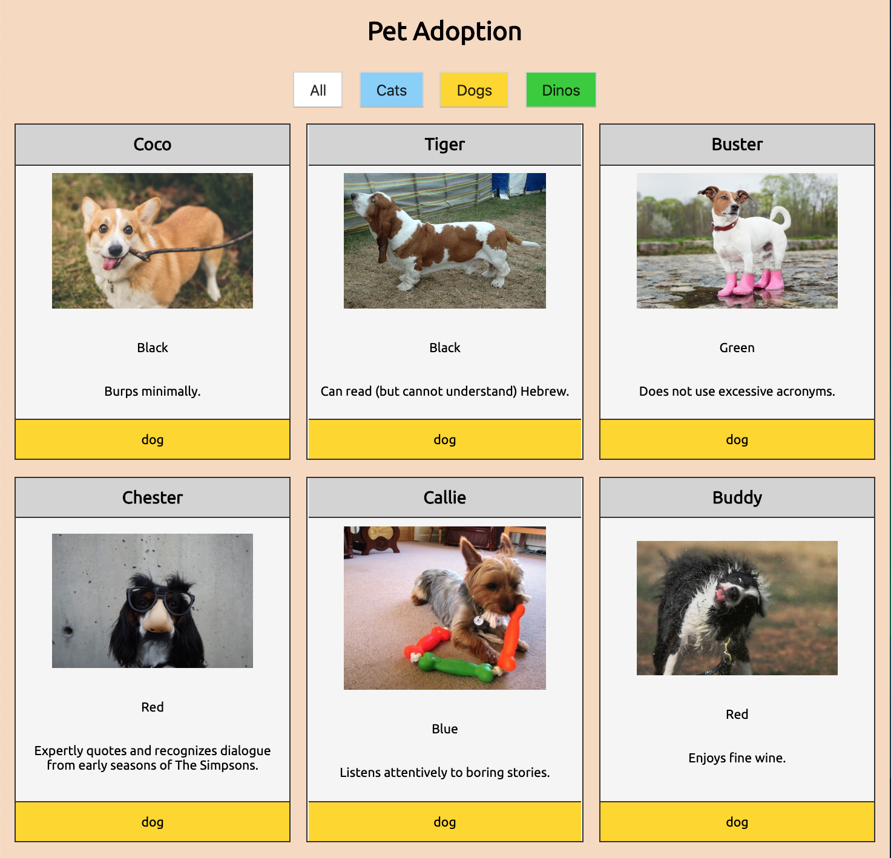

# NSS Exercise: "Pet Adoption”

### Technologies Used:
HTML5, CSS, Vanilla Javascript

### Description:
NSS homework project, which introduces these Javascript concepts:
- loop function performed on an array of objects
- event listener methods

Use hard-coded HTML, CSS styles, and Javascript to design a web page that displays a grid of cards that show pets that are available for adoption.

#### Exercise Requirements
>  - [x] cards should display for each available pet
>  - [x] each card should display `Image, Name, Color, Special Skill, and Type` for the pet
>  - [x] provide buttons that allow the user to filter pets by type
>  - [x] provide a way for the user to reset the filter (i.e., an All Pets button)

### Screenshots:

#### Main/All Pets

#### Filtered Pets (Dogs)

### Instructions to Run:
1. If you do not have npm http-server installed, follow instuctions [here](https://www.npmjs.com/package/http-server) to install on your device
1. Use GitHub's [Cloning Feature](https://help.github.com/en/github/creating-cloning-and-archiving-repositories/cloning-a-repository) to download a local copy of the files for this project
1. In your command line interface, change directory into the folder that contains your copied files
1. Enter command: `http-server -p 8080` or `hs -p 8080`
1. The project will now render in your browser at url: `http://localhost:8080`
